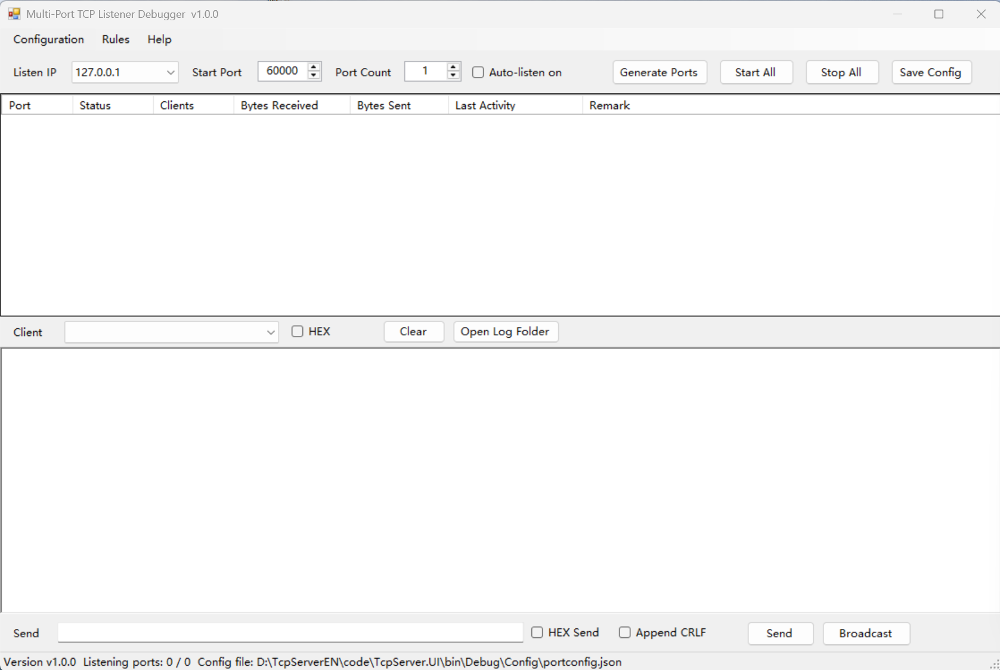

# Multi-Port TCP Listener Debugger (TcpServer)

A Windows host-application tool for multi-port TCP listening and protocol simulation:
**open a batch of ports and let them listen, while the port list and reply rules are saved
automatically — no re-entering next time.**



*The main window: multi-port listen control, live port grid, per-client data console, and send area.*

---

## Table of Contents

| # | Section |
|---|---|
| 1 | [What Problem Does It Solve](#1-what-problem-does-it-solve) |
| 2 | [Screenshot and UI Layout](#2-screenshot-and-ui-layout) |
| 3 | [Architecture Overview](#3-architecture-overview) |
| 4 | [Project Structure](#4-project-structure) |
| 5 | [Class Design in Detail](#5-class-design-in-detail) |
| 6 | [Concurrency Model](#6-concurrency-model) |
| 7 | [Reliability Design](#7-reliability-design) |
| 8 | [Engineering Highlights](#8-engineering-highlights) |
| 9 | [Build and Run](#9-build-and-run) |
| 10 | [Configuration Persistence](#10-configuration-persistence) |
| 11 | [Logging](#11-logging) |
| 12 | [Auto Reply Rules](#12-auto-reply-rules) |
| 13 | [Default Parameters Quick Reference](#13-default-parameters-quick-reference) |
| 14 | [Connection Reliability Scenarios](#14-connection-reliability-scenarios) |
| 15 | [Notes and Known Limits](#15-notes-and-known-limits) |
| 16 | [Appendix A · Log Cleanup Rules in Detail](#appendix-a--log-cleanup-rules-in-detail) |
| 17 | [Appendix B · Config Backup Cleanup Rules](#appendix-b--config-backup-cleanup-rules) |
| 18 | [Appendix C · Auto Reply Rules in Detail](#appendix-c--auto-reply-rules-in-detail) |

---

## 1. What Problem Does It Solve

Conventional network debugging assistants (NetAssist, sscom, CommCat, etc.) can only hold one port
per instance — opening 20 ports means opening 20 windows, and closing them means typing the port
configuration all over again.

This tool's approach: enter the **start port + port count** in the UI, click once, and it opens that
many consecutive ports starting from the start port. **The whole list is persisted automatically**
and restored directly on the next launch.

Beyond plain listening it also provides **rule-driven automatic replies**, so the host-side
send/receive flow can be exercised end-to-end **without the real device present**, including
deliberate response delays to test client-side timeout and retry logic.

---

## 2. Screenshot and UI Layout

The screenshot above (`TCPSERVER.PNG`, in this directory) shows the main window. Its areas:

| # | Area | Contents |
|---|---|---|
| ① | Menu bar | `Configuration` / `Rules` / `Help` |
| ② | Parameter bar | Listen IP dropdown, Start Port, Port Count, `Auto-listen on` |
| ③ | Action buttons | `Generate Ports` / `Start All` / `Stop All` / `Save Config` |
| ④ | Port grid | Port / Status / Clients / Bytes Received / Bytes Sent / Last Activity / Remark |
| ⑤ | Data console header | Client selector, `HEX` display toggle, `Clear`, `Open Log Folder` |
| ⑥ | Data console | Send/receive stream for the selected client |
| ⑦ | Send area | Payload, `HEX Send`, `Append CRLF`, `Send`, `Broadcast` |
| ⑧ | Status bar | Version, listening-port statistics, live config-file path |

Two details visible in the screenshot that are worth noting as design decisions:

- **The status bar prints the resolved absolute path** of `portconfig.json`
  (e.g. `…\bin\Debug\Config\portconfig.json`). On site this removes the
  "which config file is it actually reading?" ambiguity, which is the most common source of
  "my change had no effect" reports.
- **`Listening ports: 0 / 0`** — the denominator counts *enabled* ports in the list, the numerator
  counts ports actually listening. Showing both makes the state unambiguous.

---

## 3. Architecture Overview

A classic **five-layer, strictly one-way dependency** desktop architecture:

```
┌───────────────────────────────────────────────────────────────┐
│  TcpServer.UI            WinForms presentation layer          │
│  frmMain / frmMain.Console / frmRuleManager / frmAbout        │
│  Program (entry) · UiHelper · PortGridHelper                  │
└───────────────────────────┬───────────────────────────────────┘
                            │
┌───────────────────────────▼───────────────────────────────────┐
│  TcpServer.BLL           Business logic layer                 │
│  TcpServerManager   (multi-port orchestration)                │
│  PortListener       (one listener per port, partial class)    │
│    ├─ PortListener.cs            core + lifecycle             │
│    ├─ PortListener.Session.cs    session / client handling    │
│    └─ PortListener.Watchdog.cs   watchdog + self-healing      │
│  ClientSession      (one TCP session)                         │
│  AutoReplyEngine    (rule matching and reply)                 │
│  ConfigBLL          (config orchestration + validation)       │
└───────────────────────────┬───────────────────────────────────┘
                            │
┌───────────────────────────▼───────────────────────────────────┐
│  TcpServer.DAL           Data access layer                    │
│  IConfigRepository  (abstraction)                             │
│  JsonConfigRepository (JSON implementation)                   │
└───────────────────────────┬───────────────────────────────────┘
                            │
┌───────────────────────────▼───────────────────────────────────┐
│  TcpServer.Model         Entity layer                         │
│  AppConfigModel · PortConfig · PortRuntimeInfo · ClientInfo    │
│  AutoReplyRule · PortState · DataDirection                    │
└───────────────────────────────────────────────────────────────┘

              ┌──────────────────────────────────────┐
              │  TcpServer.Common   Shared layer     │
              │  AppConstants · Helpers\*            │
              │  (referenced by every layer above)   │
              └──────────────────────────────────────┘
```

**Dependency rule**: `UI → BLL → DAL → Model`, one-way only, **no reverse references**.
All layers may reference `Common`. Verified from the five `.csproj` files:

| Project | Output | References |
|---|---|---|
| `TcpServer.Model` | Library | *(none — pure entities)* |
| `TcpServer.Common` | Library | *(none — leaf shared layer)* |
| `TcpServer.DAL` | Library | Common, Model |
| `TcpServer.BLL` | Library | Common, DAL, Model |
| `TcpServer.UI` | WinExe | Common, DAL, Model, BLL |

`Model` and `Common` reference nothing — they are the bottom of the graph, so there is no
possibility of a dependency cycle.

### Why this shape

- **`TcpServer.DAL` is an interface + implementation pair.** The UI and BLL never see a file path
  or a JSON detail; they talk to `IConfigRepository`. Migrating persistence from JSON to
  SQLite / a database means writing one new class and changing the construction site — no change to
  UI or business logic.
- **`TcpServer.Model` contains no logic, only data.** Entities carry no file, network or UI
  dependency, so they are trivially testable and can be serialised anywhere.
- **`PortListener` is split into three files via `partial class`** (core / session / watchdog).
  This respects the project's "**one class must not exceed 800 lines**" rule while keeping all three
  parts of one listener's state in one object — no artificial helper-class indirection.

---

## 4. Project Structure

```
TcpServer\
├── TcpServer.sln
├── TcpServer.Model\               ← Entity layer
├── TcpServer.Common\              ← Shared layer (logging/config/extensions/network/validation)
├── TcpServer.DAL\                 ← Data access layer (config persistence)
├── TcpServer.BLL\                 ← Business logic layer (listener service / reply engine)
├── TcpServer.UI\                  ← Presentation layer (WinForms)
├── TCPSERVER.PNG                  ← Screenshot of the running application
└── README.md                      ← This document
```

### Source files at a glance

| Layer | File | Lines | Responsibility |
|---|---|---|---|
| BLL | `TcpServerManager.cs` | 700 | Multi-port orchestration, the single façade the UI talks to |
| BLL | `PortListener.cs` | 686 | Core listener lifecycle, state machine, statistics |
| BLL | `PortListener.Watchdog.cs` | 216 | Watchdog thread, self-healing rebuild |
| BLL | `PortListener.Session.cs` | 157 | Session acceptance, client registry |
| BLL | `ClientSession.cs` | 513 | One TCP session: receive loop, send, keep-alive |
| BLL | `AutoReplyEngine.cs` | 338 | Rule matching (4 modes), encoding, reply text |
| BLL | `ConfigBLL.cs` | 243 | Config load/save/backup/validation |
| DAL | `JsonConfigRepository.cs` | 317 | JSON persistence, normalisation, `.bak` rotation |
| DAL | `IConfigRepository.cs` | 44 | Persistence abstraction |
| Common | `Helpers\LogHelper.cs` | 761 | Asynchronous logging, rolling, cleanup thread || Common | `Helpers\ConfigHelper.cs` | 307 | Typed access to `App.config` with range guarding |
| Common | `Helpers\FileHelper.cs` | 276 | File / backup / retention helpers |
| Common | `AppConstants.cs` | 135 | All default constants in one place |
| UI | `Forms\frmMain.cs` | 740 | Main window: port management, lifecycle, config sync |
| UI | `Forms\frmMain.Console.cs` | 406 | Data console: stream view, send, client selection |
| UI | `Forms\frmRuleManager.cs` | 376 | Reply-rule editor grid |

*(`*.Designer.cs` files are designer-generated layout and are excluded from this table.)*

**Roughly 5,500 lines of hand-written C# across 45 source files, zero third-party UI dependencies.**
The only NuGet package in the whole solution is `Newtonsoft.Json`.

---

## 5. Class Design in Detail

### 5.1 `TcpServerManager` — the orchestration façade

`TcpServerManager` is the **only BLL type the UI holds**. It owns a dictionary of `PortListener`
instances and exposes a port-number-addressed API, so the UI never manages listener objects directly.

| Member group | Signature (abridged) | Purpose |
|---|---|---|
| Configuration | `SetPortConfigs`, `SetRules`, `SetListenIp` | Push the desired state down |
| Lifecycle | `StartAll`, `StopAll`, `StartPort`, `StopPort` | Bulk and per-port control |
| Data | `SendToClient`, `SendToAllClients` | Routing a payload to the right session |
| Query | `GetRuntimeInfos`, `GetRuntimeInfo`, `GetClientList`, `ListeningCount` | Snapshot for the UI grid |
| Events | `PortStateChanged`, `ClientChanged`, `DataReceived`, `DataSent` | Aggregated from all listeners |

The four events are **re-published and re-raised from the individual listeners**, so the UI
subscribes once instead of once per port. This is why `frmMain` can stay unaware of how many ports
exist.

### 5.2 `PortListener` — one listener, three files

Each port is an independent object owning its accept loop, its client registry and its statistics.

| Member | Purpose |
|---|---|
| `Port`, `ListenIp`, `State`, `StateMessage` | Identity and the state exposed to the grid's Status column |
| `ClientCount`, `IsListening` | Cheap state probes |
| `Start` / `Stop` / `ChangeListenIp` | Lifecycle; `ChangeListenIp` is guarded so it is only legal while stopped |
| `SendToClient` / `SendToAllClients` | Outbound data |
| `GetClientList` / `GetRuntimeInfo` | Snapshot for the grid |
| `StateChanged` / `ClientChanged` / `DataReceived` / `DataSent` | Per-port notification |

The **state machine** is `Stopped → Starting → Listening → Stopping → Stopped`, plus a terminal
`StartFailed` for a port that could not bind (typically already occupied). `StateMessage` carries a
human-readable reason that the Status column renders directly.

The three-file split:

| File | Contents |
|---|---|
| `PortListener.cs` | Fields, properties, constructor, `Start`/`Stop`, statistics, dispose |
| `PortListener.Session.cs` | Accept loop, session registration/deregistration, cleanup callbacks |
| `PortListener.Watchdog.cs` | Watchdog thread, generation counter, self-healing rebuild |

### 5.3 `ClientSession` — one TCP connection

| Member | Purpose |
|---|---|
| `SessionId`, `LocalPort`, `RemoteEndPoint` | Identity for the client dropdown |
| `ConnectedTime`, `LastActiveTime` | Timestamps for the grid's "Last Activity" |
| `BytesReceived`, `BytesSent` | Monotonic counters (see 6.3) |
| `IsConnected` | Volatile liveness flag |
| `StartReceive`, `Send`, `Close` | Operations |
| `ToClientInfo` | Projection to the UI-facing `ClientInfo` entity |

Two behaviours in this class are deliberate:

- **TCP keep-alive is configured explicitly** through
  `IOControl(IOControlCode.KeepAliveValues, …)` with a 12-byte payload
  `[enable 4B][idle ms 4B][interval ms 4B]`. Setting only `KeepAlive = true` is **equivalent to not
  enabling it** on Windows, because the OS default idle time is 2 hours.
- **`NoDelay = true`** disables Nagle's algorithm. For a protocol debugging tool, accurate timing
  matters more than packing efficiency — Nagle would silently coalesce small writes and make the
  observed packet boundaries a lie.

### 5.4 `AutoReplyEngine` — rule matching

| Member | Purpose |
|---|---|
| `TextEncoding` | Text codec, **GBK by default** so it matches the on-site devices |
| `UpdateRules` / `GetRules` | Hot-swap the active rule set without restarting |
| `TryMatch` | First-match-wins evaluation over the ordered rule list |
| `TextToBytes` / `BytesToText` | Conversion used by both matching and replying |

Rules are evaluated **from the first row downward and stop at the first hit**, so rule order is
semantically significant — which is why the editor exposes `Move Up` / `Move Down`.

### 5.5 `LogHelper` — the asynchronous logging subsystem

| Member | Purpose |
|---|---|
| `Instance` | Process-wide singleton |
| `LogDirectory`, `FilePath` | Where the files live |
| `PendingCount` | Queue depth (observability during a flood) |
| `CleanupRunning` | Whether the cleanup thread is active |
| `Debug` / `Info` / `Warn` / `Error` / `Fatal` | Level-specific entry points |
| `WritePortLog` / `GetPortLogFilePath` | Separate stream per port |
| `Flush`, `Shutdown` | Graceful drain on exit |
| `CleanExpiredLogs` | Retention enforcement |

### 5.6 `ConfigBLL` + `IConfigRepository` — the persistence seam

| Member | Purpose |
|---|---|
| `ConfigFilePath` | Absolute path, surfaced in the status bar |
| `LoadConfig` / `SaveConfig` | Read and write |
| `BackupConfig` | Timestamped `.bak` rotation with a retention cap |
| `BuildPortList` | Expand start-port + count into validated `PortConfig` entries |
| `FindDuplicatedPorts` | Duplicate detection before committing a list |

`ConfigBLL` knows *what* to persist; `JsonConfigRepository` knows *how*.
`JsonConfigRepository` additionally performs **normalisation** on load — malformed hand-edited port
entries that would otherwise crash startup are dropped rather than propagated.

---

## 6. Concurrency Model

This is the part of the application with the most engineering weight: one process may run
**20 listening ports × 64 clients = up to 1,280 concurrent sessions**, all competing for the UI
thread and the log file.

### 6.1 Thread inventory

| Thread | Owned by | Role |
|---|---|---|
| UI thread | WinForms | Rendering and user input only |
| Accept thread | each `PortListener` | A dedicated blocking `AcceptTcpClient` loop, one per port |
| Receive thread | each `ClientSession` | One blocking read loop per session |
| Watchdog thread | each `PortListener` | Periodic health check and rebuild |
| Log writer thread | `LogHelper` | The **only** thread that touches log file handles |
| Log cleanup thread | `LogHelper` | Periodic retention enforcement |
| Timer | `frmMain` (`tmrRefresh`) | 1-second grid refresh tick |

### 6.2 Why logging is asynchronous

The single most important concurrency decision. Under the earlier design every log line meant
"open file → write → close file", and system logs shared one lock with port traffic logs. With 20
ports transmitting at high frequency, **all receive threads serialised on file I/O** and
throughput collapsed.

The current design: **business threads only enqueue; one dedicated writer thread persists to disk**,
and the file handle stays open rather than being reopened per line. Receive threads no longer wait
on the disk at all.

Back-pressure is handled by **dropping the oldest queue entries** when the queue is full
(`LogQueueMaxLength`, default 20,000), rather than blocking the producer. For a debugging tool this
is the right trade-off: a debugging tool must never be the reason the traffic stops.

### 6.3 Locking and atomicity

| Primitive | Where | Why |
|---|---|---|
| `lock` | `LogHelper` (×8), `TcpServerManager` (×10), `PortListener` (×3) | Protect shared collections and the log queue |
| `Interlocked.Increment` / `Add` | Byte counters, client counts | Counter updates must never be lost under concurrency |
| `Interlocked.Read` | Reading 64-bit counters | A plain read of a `long` is not atomic on 32-bit |
| `Interlocked.CompareExchange` | `_lastActiveTicks` | `DateTime` is not an atomic type, so a CAS loop advances it safely |
| `volatile` | Liveness flags, running flags | Guarantees visibility across threads without a full lock |
| `ManualResetEventSlim` | `PortListener`, `LogHelper` | **Interruptible sleep** — see 6.4 |
| ThreadPool.QueueUserWorkItem | Delayed reply scheduling in `TcpServerManager` | A delayed reply must not stall a receive thread |

### 6.4 Interruptible waits instead of `Thread.Sleep`

`Thread.Sleep` cannot be interrupted, which forces a shutdown to wait out the remainder of the
sleep. Every wait in this codebase is therefore a `ManualResetEventSlim.Wait(intervalMs)` paired
with a `Set()` in the stop path. Two consequences:

- **Stopping is immediate.** Shutting down 20 listening ports does not cost 20 × interval; the
  watchdog and cleanup threads wake on the signal and exit at once. (In an earlier build this cost a
  full second per port.)
- **The watchdog generation counter.** If `Stop` is immediately followed by `Start`, the previous
  watchdog thread may still be sleeping. On waking it would observe `_watchdogRunning == true`, keep
  inspecting, and you would end up with **two active watchdogs rebuilding the listener concurrently**.
  A monotonically increasing generation number lets a superseded thread recognise that it has been
  replaced and exit. This is a subtle, real bug class that only appears when a user rapidly toggles
  a port — exactly what happens during on-site commissioning.

### 6.5 Sending without stalling

- **Per-session send lock.** `lock (_sendLock)` serialises sends on one session, because two
  concurrent `Send` calls on the same socket would interleave and corrupt the packet boundaries.
- **Send timeout (`SendTimeoutMs`, default 10 s).** If a client connects but never reads, the
  peer's receive window closes and a blocking `Send` would hang the caller. The timeout converts
  this into a reported failure — "client may be connected but not reading data" — instead of a
  frozen UI. This was a real defect in earlier builds.
- **`Buffer.BlockCopy` before raising the event.** The receive buffer is copied before the data is
  handed to subscribers; otherwise the next read would overwrite the array while the UI was still
  consuming it.
- **Cross-thread marshalling.** All UI updates from worker threads go through `InvokeSafely`, which
  checks `InvokeRequired`, `IsDisposed` and `IsHandleCreated` before marshalling and never throws
  during shutdown. Without the disposal checks, a late callback during window close would raise an
  `ObjectDisposedException` on a background thread — an unhandled-exception crash.

---

## 7. Reliability Design

The program is built to be left running unattended on a production machine, which drives four
specific mechanisms.

### 7.1 The three ways a client can disappear

| How the client disappears | What the server sees | Handling |
|---|---|---|
| User closes it / graceful exit | FIN | Cleaned up in **milliseconds**; port immediately reusable |
| Process crash / force-killed | RST | Cleaned up in **milliseconds** |
| **Cable pulled / sudden power loss** | *Nothing at all* | **TCP keep-alive probing**, cleaned up in about **30 s** |

The third row is the reason keep-alive exists. A peer that loses power sends no FIN and no RST, so a
blocking `Receive` would wait forever and the session would remain a **zombie**, permanently
occupying one of the 64 slots. Once 64 zombies accumulate, the port silently stops accepting new
connections.

**Long-lived connections are never killed by mistake**: a keep-alive probe is an empty data segment
answered by the peer's **OS kernel**, so the peer application layer need do nothing. As long as the
peer machine is powered and reachable, the connection survives even with zero application traffic
for hours. The probe timings (idle 15 s, interval 3 s, ~5 retries) live in `App.config` and take
effect on restart — **no recompile required**.

### 7.2 The listener never gives up

Earlier builds exited the accept loop when accepting raised an exception, leaving the port
displayed as listening while refusing every connection — a silently dead listener that required a
manual restart. The current accept loop **skips the failed attempt, backs off briefly, and keeps
listening**, so "reconnect after disconnect" always works for short-lived clients.

### 7.3 The watchdog closes the remaining gap

If the accept thread exits for a reason other than an accept exception, a watchdog thread — polling
every `WatchdogIntervalMs` (default 5 s) — **detects it and rebuilds the listener automatically**,
logging the recovery; the UI status becomes "Listening (auto-recovered)". This closes the
"shows Listening but cannot connect, restart required" class of failure entirely.
Set `WatchdogIntervalMs` to `0` to disable it.

### 7.4 Immutable configuration contract

`App.config` is **read-only**: the program reads it at startup and never writes back. All
user-editable state lives in `portconfig.json`, written on explicit save only. This satisfies
Article 13 of the project's desktop C# standard ("configuration files are read-only; parameters
requiring write-back belong in a database") while keeping on-site tuning possible by hand-editing
one XML file.

Additionally the application is **single-instance**, enforced by a named mutex
(`AppConstants.MUTEX_NAME`), so a second launch is refused rather than silently competing for the
same ports.

---

## 8. Engineering Highlights

A summary of the decisions that make this more than a socket wrapper:

| # | Highlight | Where |
|---|---|---|
| 1 | **Asynchronous logging pipeline** — producers enqueue, one writer thread persists, file handle held open; business threads never touch the disk | `LogHelper` |
| 2 | **Keep-alive with explicit timings** via `IOControl(KeepAliveValues)`, because `KeepAlive = true` alone is inert on Windows (2-hour default) | `ClientSession` |
| 3 | **Watchdog generation counter** preventing two concurrent watchdogs from rebuilding the same listener | `PortListener.Watchdog` |
| 4 | **Interruptible waits** (`ManualResetEventSlim`) so shutdown is immediate instead of waiting out each interval | `PortListener`, `LogHelper` |
| 5 | **Send timeout** converting a blocking send into a reported failure, so one unresponsive client cannot freeze the UI | `ClientSession` |
| 6 | **Atomic statistics** — `Interlocked` for counters, CAS loop for the non-atomic `DateTime` last-active stamp | `PortListener` |
| 7 | **Repository seam** — `IConfigRepository` isolates persistence so JSON can become SQLite/database without touching UI or BLL | `TcpServer.DAL` |
| 8 | **Single-class split via `partial`** honouring the 800-line rule without introducing artificial helper indirection | `PortListener.*` |
| 9 | **Repository normalisation on load** — hand-edited malformed config entries are dropped instead of crashing startup | `JsonConfigRepository` |
| 10 | **Bounded retention everywhere** — log queue length, log file size, log retention months, `.bak` count are all capped so nothing grows without bound | `AppConstants`, `LogHelper`, `JsonConfigRepository` |
| 11 | **Configurable via `App.config` only** — every threshold is tunable on site without a rebuild | whole project |
| 12 | **Defensive cross-thread UI marshalling** guarding `IsDisposed` / `IsHandleCreated` so shutdown never raises an unhandled exception | `frmMain.InvokeSafely` |

---

## 9. Build and Run

1. Open `TcpServer.sln` with **Visual Studio 2019 / 2022**
2. On first open, right-click the solution → **Restore NuGet Packages**
   (the only package referenced is `Newtonsoft.Json`)
3. Press F5 to run. The `Config\` and `Logs\` folders are created automatically under the output
   directory

- Target framework: **.NET Framework 4.7.2** (consistent with other on-site projects; builds
  directly in VS)
- Output executable: `TcpServer.UI.exe`

### Menu reference

| Menu | Item | Action |
|---|---|---|
| Configuration | Save Config | Persist the current settings |
| Configuration | Reload Config | Discard unsaved changes and reload from disk |
| Configuration | Open Config Folder | Open the folder containing `portconfig.json` |
| Configuration | Open Log Folder | Open the log directory |
| Configuration | Exit | Save and stop all ports |
| Rules | Reply Rules… | Open the reply-rule editor |
| Help | About | Version and path information |

**Shortcut**: **double-click a row** in the port list to start / stop listening on that single port.

---

## 10. Configuration Persistence

| File | Contents | Writable |
|---|---|---|
| `Config\portconfig.json` | Listen address, start port, port count, port list, reply rules | **Writable** (written on save; a `.bak` backup is created first) |
| `TcpServer.UI.exe.config` | Default IP, default start port, log retention months, buffer size and other runtime parameters | Read-only (per coding standard: config file data is read-only, never written back) |

> Note: Article 13 of the desktop *C# Development Standard* requires "configuration files are
> read-only; parameters that need writing back belong in a database." This tool's business
> configuration is user-entered data, so by the intent of that article it lives separately in
> `portconfig.json`, decoupled from the read-only `App.config`. To migrate to SQLite/database later,
> only the `TcpServer.DAL` implementation class needs replacing.

**Backup retention limit**: every save creates a timestamped `.bak`. By default only the **latest
20** are kept; older ones are deleted automatically (`App.config` → `ConfigBackupKeepCount`).
Without a limit, the Config directory would accumulate thousands of small files over time.

---

## 11. Logging

- System log: `Logs\{level}_{yyyyMMdd}.log` (separate files for info / warn / error / fatal)
- Port stream: `Logs\Port_{port}_{yyyyMMdd}.log` (one per port, for isolated troubleshooting)
- Retention: **6 months** by default. Expired files are cleaned automatically on startup
  (adjustable via `LogKeepMonths` in `App.config`)

**Write path (asynchronous)**: business threads only enqueue into an in-memory queue; a dedicated
writer thread handles the disk writes, and the file handle stays open instead of repeatedly opening
and closing the file. With 20 ports sending and receiving at high frequency, receive threads no
longer slow down waiting on disk.

- Queue limit defaults to **20,000 entries** (`App.config` → `LogQueueMaxLength`). When the queue is
  full, **the oldest entries are discarded** to protect memory; throughput is never slowed down.
- A single log file that exceeds **20 MB** is automatically rolled into `xxx_1.log`, `xxx_2.log`, …
  (`App.config` → `LogMaxFileSizeBytes`). Cleanup still applies uniformly by retention months.
- On graceful exit, the remaining queued logs are flushed first. **Note**: if the process is
  force-killed (ended via Task Manager), the last few lines may not reach disk.

---

## 12. Auto Reply Rules

Menu "Rules → Reply Rules…" supports:

- **Rule Name / Enabled switch**
- **Match**: "Match HEX" can be checked (e.g. `4F 4B`); "Exact Match" checked requires the whole
  packet to match, unchecked means "contains" is enough
- **Reply**: also supports HEX
- **Delay (ms)**: simulates device response latency
- **Port Only**: `0` applies to all ports; a specific port number restricts the rule to that port

The first matching rule wins; rule order can be adjusted with "Move Up / Move Down".

A delayed reply is scheduled on the **thread pool** (`TcpServerManager`, via
`ThreadPool.QueueUserWorkItem`), so simulating an 800 ms device latency does not block the receive
thread — a property that matters when several clients trigger rules at once.
Full semantics, the four matching modes and six worked examples are in
[Appendix C](#appendix-c--auto-reply-rules-in-detail).

---

## 13. Default Parameters Quick Reference

| Parameter | Default | Location |
|---|---|---|
| Start port | 60000 | UI / `App.config` |
| Max port count | 200 | UI limit |
| Listen address | 127.0.0.1 | UI dropdown / `App.config` |
| Receive buffer | 8192 bytes | `App.config` |
| Receive loop interval | 20 ms | `App.config` |
| Max clients per port | 64 | `PortListener.MAX_CLIENTS_PER_PORT` |
| TCP keep-alive enabled | true | `App.config` → `KeepAliveEnabled` |
| TCP keep-alive idle start | 15 s | `App.config` → `KeepAliveIdleSeconds` |
| TCP keep-alive probe interval | 3 s | `App.config` → `KeepAliveIntervalSeconds` |
| Send timeout | 10 s | `App.config` → `SendTimeoutMs` |
| Listener watchdog interval | 5 s | `App.config` → `WatchdogIntervalMs` |
| Max single log file size | 20 MB | `App.config` → `LogMaxFileSizeBytes` |
| Log queue limit | 20000 entries | `App.config` → `LogQueueMaxLength` |
| Config backup retention | 20 files | `App.config` → `ConfigBackupKeepCount` |
| Log retention | 6 months | `App.config` |
| Application version | 1.0.0 | `AppConstants.APP_VERSION` |

---

## 14. Connection Reliability Scenarios

There are three ways a client can disappear, and the program handles each differently:

| How the client disappears | What the server sees | Handling |
|---|---|---|
| User closes it / graceful exit (normal for short-lived) | FIN | Cleaned up in **milliseconds**; port is immediately reusable |
| Process crash / force-killed | RST | Cleaned up in **milliseconds** |
| **Cable pulled / sudden power loss** | Nothing at all | **TCP keep-alive probing**, cleaned up in about **30 seconds** |

**Long-lived connections are never killed by mistake**: keep-alive probes are answered directly by
the peer's **OS kernel** (the probe is an empty data segment), so the peer application layer needs
to do nothing. As long as the peer machine is still online, the connection stays up even if not a
single byte is sent for an hour.

- Idle **15 seconds** ≠ disconnect after 15 seconds; it only means "start probing after 15 seconds
  of silence"
- Failed probes retry 5 times at 3-second intervals by system default → about **30 seconds** to
  declare the peer lost
- All three values live in `App.config`; restart the program after changing them — no recompile
  needed

**Listener self-healing**: if accepting a connection hits an exception, the accept loop no longer
exits (older builds died silently and required a restart) but skips that attempt and keeps
listening, so "reconnect after disconnect" always works for short-lived connections.

**Watchdog fallback**: if the accept thread exits for some other reason (not an accept exception),
the watchdog — polling every 5 seconds — **rebuilds the listener automatically** and writes a log
entry; the UI status becomes "Listening (auto-recovered)". In other words, the "shows Listening but
can't connect, restart required" path has been closed off. Set `WatchdogIntervalMs` to `0` in
`App.config` to disable this feature.

**Fast shutdown**: the watchdog normally waits out its polling interval, but on stop it is **woken
immediately** (it does not sit out the full 5 seconds), so closing even 20 listening ports is
instant and all ports are released right away. Early builds wasted 1 second per port here; that is
fixed.

**The UI never freezes on send**: if a client connects but never reads its data, older builds would
**freeze the whole UI** once the peer's buffer filled up. There is now a **10-second send timeout**
(`App.config` → `SendTimeoutMs`) that gives up and reports "Send timed out (the client may be
connected but not reading data)". Setting it to `0` means no limit (not recommended).

**One limit to know**: a single port accepts at most 64 clients. Sessions left behind by power loss
are cleaned up by keep-alive and do not occupy slots long-term; without keep-alive, once 64
accumulate, new connections are rejected — which is exactly why keep-alive exists.

---

## 15. Notes and Known Limits

- Choosing `127.0.0.1` as the listen address means **only this machine** can connect. To let on-site
  devices connect from outside, switch to a local NIC address or `0.0.0.0`.
- All ports must be stopped before changing the listen address; the program blocks and warns
  otherwise.
- The application is **single-instance**; launching it twice is refused.
- If a port is already held by another program, that port is marked "Start Failed" and skipped
  without affecting the rest.
- Port availability is checked **against the actual listen address** (e.g. for `127.0.0.1:60000`
  that exact address is probed), so another program holding the same port on a different NIC does
  not cause a false positive.
- **High-DPI (reverted on 2026-09-14)**: high-DPI awareness was previously declared (`app.manifest`
  + `DpiAwareness` in `App.config`). On a 150%-scaled display this measurably produced **a smaller
  UI plus clipped text in the top toolbar**. Root cause: `AutoScaleMode=Font` derives its scale
  factor from `Font.Height`, which .NET computes at a fixed 96 DPI and does not vary with high DPI —
  so the factor stays 1.0 and controls do not grow, while GDI+ still renders glyphs at 144 DPI. It
  has been fully reverted to system bitmap stretching. Text is slightly softer on high-DPI screens
  now, but dimensions and layout are 100% correct.
- To re-enable high-DPI crispness, **three places must change together** (see the note at the end of
  `app.manifest`): ① restore the `<application><windowsSettings>` node in the manifest;
  ② restore the `<System.Windows.Forms.ApplicationConfigurationSection>` node in `App.config`;
  ③ change `AutoScaleMode` from `Font` to `Dpi` on all three forms and `AutoScaleDimensions` to
  `(96F, 96F)`. Changing only the first two reproduces the clipping seen this time.
- **"Append 0x0D 0x0A" checkbox (added 2026-09-14)**: when checked, every manual send (including
  broadcast) appends `0D 0A` (carriage return + line feed) to the end of the payload.
  **It applies in both text and HEX modes** — the append happens on the final byte stream after
  parsing, so it is independent of the input format.
  Note: in HEX mode, if `0D 0A` is already written into the content, it is appended once more (no
  de-duplication). This keeps the "checked means always appended" behaviour predictable.
- **Automatic log cleanup (completed 2026-09-14)**: logs are split by type and date
  (system log `info_20260914.log`, port stream `Port_60000_20260914.log`).
  Expiry cleanup is based on **the file's last write time**; anything older than `LogKeepMonths`
  (6 months by default) is deleted. Cleanup previously ran **only once at startup**, so a
  long-running program (e.g. permanently deployed on site) would never clean up. A dedicated
  cleanup thread now executes periodically according to `App.config` → `LogCleanupIntervalHours`
  (24 hours by default). Set it to `0` to disable periodic cleanup.
- **About the file count**: port streams are split by port and date, so 20 ports running for a month
  produce roughly 600 files. Many are "small files" that received a few lines on the day they
  started and were never written again; they survive until the full 6 months elapse.
  **This is inherent to the cleanup rule, not a fault.**
  If such empty-shell files are objectionable, lower `LogKeepMonths` (e.g. to `1`) or clean the log
  directory manually from time to time.

---

## Appendix A · Log Cleanup Rules in Detail

**Three rules apply together**, governing "when to clean" and "what to delete".

| Trigger | Behaviour |
|---|---|
| On startup | Cleans expired files once and records the deleted count in the log |
| While running | Cleans automatically every **24 hours** (dedicated thread, new in this revision; previously only at startup) |
| On write | The current file rolls into `xxx_1.log`, `xxx_2.log` once it exceeds **20 MB** |

| Deletion condition | Description |
|---|---|
| File type | Only `*.log` is handled; no other files are touched |
| Time basis | The file's **last write time** — **not** the date in the filename, and not the creation time |
| Expiry criterion | Deleted when the last write time is earlier than "now − retention months" (`AddMonths` is calendar-based, so long/short months and leap months are handled correctly) |
| Rolled volumes | `xxx_1.log` / `xxx_2.log` also match `*.log` and participate in cleanup by their own write times, so none are missed |
| Failure handling | A file that cannot be deleted does not affect other files or the main flow; open write handles are flushed and released before deletion |

**⚠️ The most commonly misunderstood point: the criterion is "last write time", so files get an
automatic extension.**

As long as a port is still in use, its log file keeps being written and its timestamp keeps
refreshing — so it **never expires**. What actually gets deleted are files for ports that were never
used again. That is also why the 0.5 KB small files mentioned under "About the file count" persist
for so long — they stopped being written at some point, and 6 months are counted from that day.

**Tunable parameters** (all in `App.config`, read-only; the program never writes back):

| Setting | Default | Effect |
|---|---|---|
| `LogKeepMonths` | `6` | Months to retain; values below 1 fall back to 6 |
| `LogCleanupIntervalHours` | `24` | Cleanup period; valid range 1–8760; **`0` = disable periodic cleanup** (startup cleanup only) |
| `LogMaxFileSizeBytes` | `20971520` (20 MB, written in source as `20L * 1024 * 1024`) | Roll threshold per file; valid range 1 MB – 2 GB |

**How to confirm cleanup actually ran** (cleanup is silent — no dialogs, log entries only):

Open the current day's `Logs\info_YYYYMMDD.log` and search for **`Cleaned up`**:

```
[2026-09-14 21:28:25.123] [INFO] Cleaned up 3 historical log file(s) older than 6 month(s).
```

The startup pass is also recorded in the startup log, e.g.:

```
[2026-09-14 21:28:25.100] [INFO] Application started, version v1.0.0. Startup cleanup deleted 0 expired log file(s); periodic cleanup is enabled.
```

If that line shows **`periodic cleanup is disabled`**, the cleanup thread did not start (usually
because `LogCleanupIntervalHours` was set to `0`).

---

## Appendix B · Config Backup Cleanup Rules

The `.bak` files in the config directory are automatic backups taken **on every config save**. They
are also capped and **do not grow without bound**:

| Item | Description |
|---|---|
| Naming | `portconfig_yyyyMMddHHmmss.json.bak` (a `_1`, `_2` suffix is appended for backups within the same second to avoid overwriting) |
| Trigger | Runs together with **every config save** (not on a timer) |
| Retention | The latest **20** files (`App.config` → `ConfigBackupKeepCount`, valid range 1–1000) |
| Sort order | Write time descending (filename descending when equal), ensuring the newest are kept |
| Deletion scope | **Only `portconfig_*.json.bak` with the same prefix — `portconfig.json` itself is never touched** |
| Failure handling | A single failed deletion does not affect the rest of the cleanup or the backup result |
| Directory state | Steady at **19 `.bak` files + 1 `portconfig.json`** (when the 20th backup is created, the oldest is removed at the same time) |

To change the retention count, just edit the number in `App.config` (e.g. to `5`); it takes effect
**on the next config save**, which trims down to 5 in one pass.

**Do not confuse**: `TcpServer.UI.exe.config` in the root of `bin\Debug` is **produced by the VS
build**, not by this program. The program never backs it up, and whether it is cleaned makes no
difference.

---

## Appendix C · Auto Reply Rules in Detail

**What it solves**: the program acts as a TCP server. When a client connects and sends data, the
program replies automatically per the rules — so the host-side send/receive flow can be exercised
end-to-end without the real device present.

**Three preconditions** (missing any one means no trigger):

1. The port is enabled and **listening**;
2. The data direction is **received** — manually clicking "Send" does not trigger your own rules;
3. The rule's "Enabled" box is checked and its "Port Only" matches the receiving port
   (`0` means unrestricted).

**Match evaluation order**: rules are tried from the first row downward and **stop at the first
hit** — one packet produces one reply. Rule order therefore matters; use "Move Up / Move Down" to
adjust it.

**Four matching modes** (combinations of the "Match HEX" × "Exact Match" switches):

| Match HEX | Exact Match | Evaluation |
|---|---|---|
| No | No | Hit when the received text **contains** the match text (default) |
| No | Yes | Hit only when the received text **equals** the match text exactly |
| Yes | No | Hit when the received byte stream **contains** the byte sequence |
| Yes | Yes | Hit only when the **whole received packet** equals the byte sequence exactly |

**Meaning of the 9 grid columns**:

| Column | Description |
|---|---|
| Rule Name | Used only for UI identification and log output; not involved in matching |
| Enabled | Unchecked rules are skipped entirely |
| Match | In HEX mode formatted like `01 03 00`; spaces are optional |
| Match HEX | Interpret the match content as hexadecimal |
| Exact Match | See the table above; unchecked means contains-matching |
| Reply | In HEX mode written the same way, e.g. `06` or `4F 4B 0D 0A` |
| Reply HEX | Interpret the reply content as hexadecimal |
| Delay (ms) | `0` replies immediately; the wait happens on the thread pool and **does not block the receive thread** |
| Port Only | `0` = all ports; `9001` means the rule applies to port 9001 only |

**Save takes effect immediately**: clicking OK pushes the rules to the running service at once and
writes them to `portconfig.json`, so they load automatically next time. Rules apply only to packets
received **after** the change; already-received packets are not retro-replied. Clicking Cancel
leaves all currently effective rules untouched.

**Typical examples**:

**Example 1 · Text heartbeat (the simplest)**

| Match | Match HEX | Exact Match | Reply | Reply HEX | Delay | Port Only |
|---|---|---|---|---|---|---|
| `PING` | No | No | `PONG` | No | 0 | 0 |

Any packet containing `PING` gets `PONG`.

**Example 2 · Fixed command frame answered with a single confirmation byte (HEX mode)**

| Match | Match HEX | Exact Match | Reply | Reply HEX | Delay | Port Only |
|---|---|---|---|---|---|---|
| `01 03 00 00 00 01` | Yes | No | `06` | Yes | 0 | 0 |

A packet containing this byte sequence gets a single byte `0x06`.

**Example 3 · Requiring a whole-packet exact match (avoiding false hits)**

| Match | Match HEX | Exact Match | Reply | Reply HEX | Delay | Port Only |
|---|---|---|---|---|---|---|
| `VER` | No | Yes | `1.02` | No | 0 | 0 |

With "Exact Match" unchecked, receiving `VERSION` also hits `VER`. Check "Exact Match" to keep them
strictly apart.

**Example 4 · Reply ending with CRLF**

| Match | Match HEX | Exact Match | Reply | Reply HEX | Delay | Port Only |
|---|---|---|---|---|---|---|
| `STATUS` | No | No | `4F 4B 0D 0A` | Yes | 0 | 0 |

CRLF cannot be typed into a plain text box, so a reply ending with `0x0D 0x0A` is most reliable in
HEX mode; it actually sends `OK` + CRLF.

**Example 5 · Port-specific replies**

| Match | Match HEX | Exact Match | Reply | Reply HEX | Delay | Port Only |
|---|---|---|---|---|---|---|
| `READ` | No | No | `PORT-A` | No | 0 | 9001 |
| `READ` | No | No | `PORT-B` | No | 0 | 9002 |
| `READ` | No | No | `UNKNOWN` | No | 0 | 0 |

The same keyword returns different content on different ports. The fallback row (Port Only `0`) must
come **last**, otherwise it swallows the packets destined for 9001/9002 first.

**Example 6 · Simulating a slow response**

| Match | Match HEX | Exact Match | Reply | Reply HEX | Delay | Port Only |
|---|---|---|---|---|---|---|
| `QUERY` | No | No | `OK` | No | 800 | 0 |

Responds after an 800 ms delay, useful for exercising the client's timeout and retry logic.

**Troubleshooting checklist**:

| Symptom | Check first |
|---|---|
| No reaction at all | Is the port listening; is "Enabled" checked; is "Port Only" misconfigured |
| Matched but no reply | The reply content is empty — the log records `Rule [xx] matched but the reply is empty, ignored`, and matching **continues to the next rule** |
| Non-ASCII text does not match | Text mode uses **GBK** by default; if the client sends UTF-8 text, switch to HEX mode |
| Wrong reply content | An earlier rule matched first (only the first rule replies per packet) |
| Rule change had no effect | Was OK clicked; rules apply only to packets received **after** the change |

To confirm a match, search the log for `auto-replied`; a hit produces a line like
`Port 9001 auto-replied 4 byte(s) by rule [RuleName].`

- Logs are written asynchronously, so the last few lines may be lost if the process is
  **force-killed**; a graceful close loses nothing.
